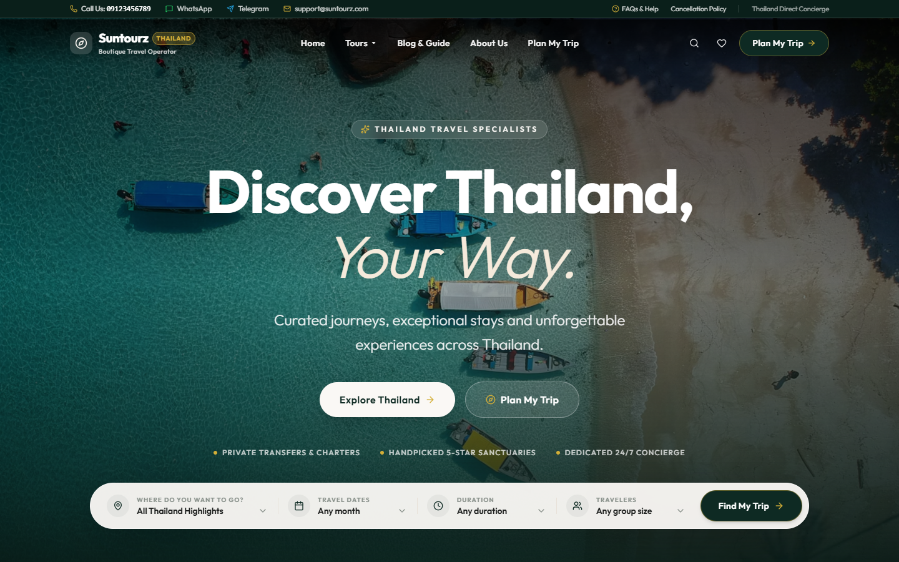

# Suntourz Theme

> A fast, modern WordPress theme for Thailand tour operators — server-rendered routes, a React front end, and a complete booking journey.

[](https://github.com/rnd21312/react-theme/actions/workflows/ci.yml)
[](LICENSE)




Suntourz is the **presentation layer** of the Suntourz suite. WordPress still owns routing, SEO and content; the theme renders each route with PHP templates and hydrates a small React app (Vite + Tailwind CSS 4) for the interactive parts: tour search and filters, departure picker, booking form, trip planner, wishlist, reviews and scroll reveals.

It is one of three independent projects:

| Project | Role |
| --- | --- |
| **react-theme** (this repo) | Public website design |
| [booking-core](https://github.com/rnd21312/booking-core) | Tours, departures, bookings, REST API, admin screens — **required** by this theme |
| [visual-editor](https://github.com/rnd21312/visual-editor) | Click-to-edit visual editor, works with any theme (optional) |

## Features

- **Home page** with hero, search bar (destination, month, duration, group size), featured tours, destinations, travel styles, reviews and guide articles.
- **Tour archive** with live filters: destination, duration, travel style, month, max price, group size, *on sale / last minute / special offer*.
- **Tour page** with overview, highlights, itinerary timeline, inclusions, gallery, reviews and a sticky **booking card** (departure picker, price per plan, seats left, live quote).
- **Plan My Trip** — a multi-step trip request form (no account required).
- **Booking journey**: request → success page with booking code. No e-mail is sent; requests land in the admin.
- **Blog & Guide**, destination and travel-style archives, About, 404 and generic page templates.
- **SEO built in**: titles, descriptions, canonical, Open Graph / Twitter cards and JSON-LD (`TravelAgency`, `TouristTrip`, `Article`, `BreadcrumbList`). Every post type has a *Search engine & sharing* box.
- **Brand controls** (logo, favicon, colours, footer) driven by the Core plugin's settings — no code needed.
- **Performance**: self-hosted variable font, critical CSS inlined, splash/reveal hydration, code-split page bundles, scroll reveals with `prefers-reduced-motion` support.
- **Plugin-aware**: shows an admin notice if Suntourz Core is not active, and a safe fallback render so the site never white-screens.

## Requirements

- WordPress **6.5+**, PHP **8.1+**
- [Suntourz Core](https://github.com/rnd21312/booking-core) plugin (active)
- Node.js 20+ only if you build from source

## Install

1. Download `react-theme.zip` from the [latest release](https://github.com/rnd21312/react-theme/releases/latest).
2. Install and activate **Suntourz Core** first.
3. **Appearance → Themes → Add New → Upload Theme** → choose the zip → **Activate**.
4. In **Suntourz → Settings → Demo data** press **Import demo tours** (optional).
5. **Appearance → Menus** → assign a menu to *Primary* and *Footer*.

Full walkthrough: [docs/installation.md](docs/installation.md).

> Installing the repository folder directly (without a release zip) shows a blank design: the compiled bundle in `dist/` is not committed. Build it with `cd frontend && npm ci && npm run build`, or use the release zip.

## Documentation

| Guide | Contents |
| --- | --- |
| [Installation](docs/installation.md) | Zip install, build from source, demo content, menus, permalinks |
| [Theme guide](docs/theme-guide.md) | Templates, page types, what each screen shows, SEO and branding |
| [Architecture](docs/architecture.md) | PHP ↔ React boundary, Vite manifest, data flow, folder map |
| [Development](docs/development.md) | Local setup, scripts, testing, release process |

## Project layout

```
react-theme/
├── style.css            theme header (visual styles live in the Vite bundle)
├── functions.php        bootstrap
├── inc/                 PHP: SEO, brand, queries, render, Vite loader
├── *.php                templates (front-page, single-stz_tour, archive-stz_tour …)
└── frontend/            React + Tailwind source (builds into ./dist)
```

## Development

```bash
cd frontend
npm ci
npm run dev        # Vite dev server on :5173
npm run build      # production bundle → ../dist
npm run typecheck && npm test
```

See [docs/development.md](docs/development.md) for running WordPress locally with WordPress Playground (no Docker needed).

## License

Released under the **GNU General Public License v2.0 or later** — see [LICENSE](LICENSE).

## Author

Created and maintained by **theodore-sooske** — Telegram [@theodore-sooske](https://t.me/theodore-sooske).
